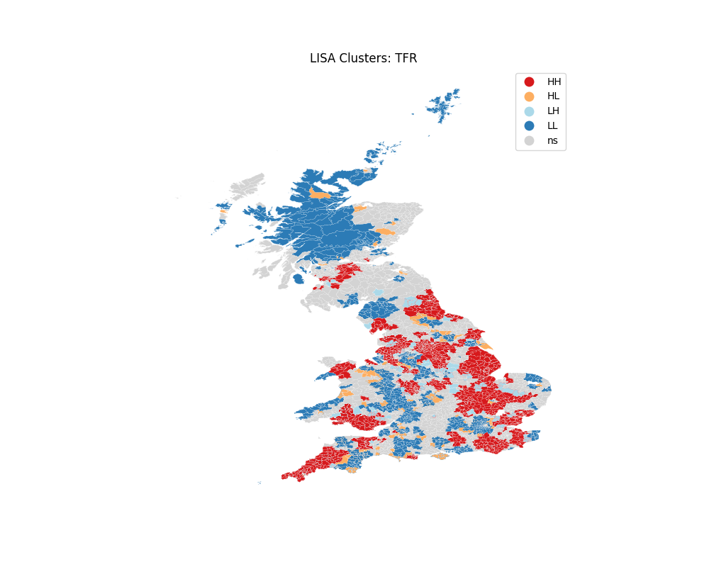

> **Executive Summary:** This brief summarizes the econometric findings regarding the impact of the 1833 and 1844 Factory Acts on British fertility. Using a Two-Way Fixed Effects approach augmented with Spatial Lag modeling, we find that the restriction of child labor acted as an exogenous catalyst for the 'Quantity-Quality' trade-off, leading to a significant divergence in fertility paths in industrial heartlands.

## Data Overview
```{python}
import pandas as pd
import os
from pathlib import Path
# When rendering, Quarto typically has scripts/ as CWD
root = Path.cwd().parent
processed_csv = root / 'exam_project' / 'data' / 'processed' / 'master_panel_data.csv'
df = pd.read_csv(processed_csv)
n_obs = len(df)
n_districts = df['REGDIST'].nunique()
```
The analysis covers `python n_obs` observations across `python n_districts` Registration Districts from 1851 to 1881. 

## Spatial Contagion & Clustering
A central finding is the high degree of **Spatial Autocorrelation** in the fertility transition. Fertility behavior was not idiosyncratic but clustered in regional hubs.

::: {layout-ncol=2}



:::

The maps above show the evolution of 'High-High' fertility clusters. By 1881, the divergence between the textile heartlands (North) and agricultural domains (South) reached its terminal peak.

## Econometric Robustness: The Spatial Lag Model (SLM)
To account for contagion effects, we implemented an SLM:
$$TFR = \rho W TFR + \beta X + \epsilon$$

Results indicate that even after controlling for the average fertility of neighbors ($\rho$), the impact of **Child Labor Removal** remains negative and statistically significant, suggesting the Factory Acts were a primary driver of the structural break.

## Conclusion
The evidence strongly supports the **Cost of Quality** hypothesis. State-level restrictions on labor, coupled with mandated schooling, altered the microeconomic foundation of Victorian family life.

---
**Reproducibility Signature:** 
Generated via Automated Pipeline | Version 2.0.0-Expert-Audit
